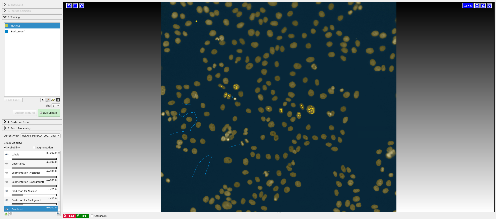
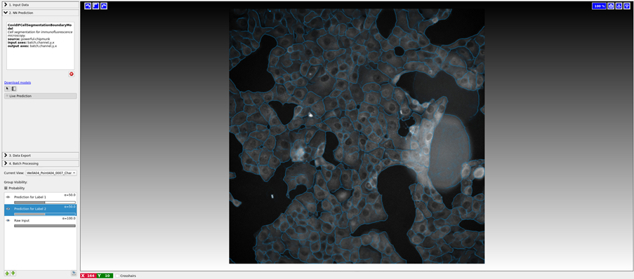
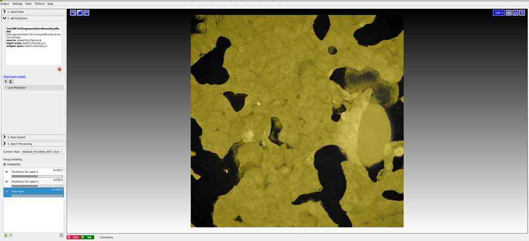
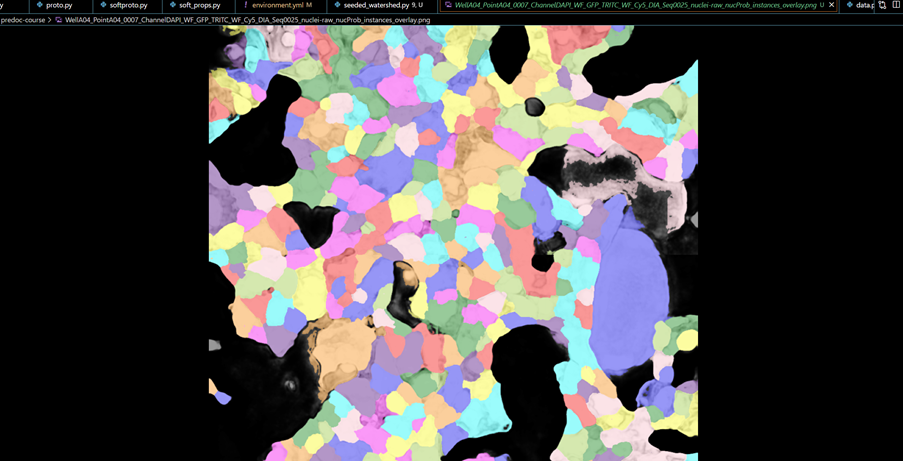

# EIPP Theory@EMBL 2025 — Cell Segmentation Challenge

*This branch contains the 2025 materials. Previous years are in other branches.*

In this year’s practical, you will learn how to design and run a **complete image segmentation pipeline** using both graphical tools (ilastik) and a simple Python script. You will work with real fluorescence microscopy data from the **COVID immunofluorescence assay**, and the goal is to segment individual cells from 2D microscopy images.

The challenge introduces the key concepts of **supervised learning in bioimage analysis**, **probabilistic predictions**, and **classical image segmentation algorithms** such as the seeded watershed. The focus is on **interpreting what each stage does**, not on writing code from scratch.

---

## How is this going to work?

Depending on your background and confidence with Python and image analysis, you can run the practical in two main ways:

* **Option 1: On EMBL’s virtual machines (recommended)**
  This avoids any installation issues. Most of the required tools are pre-installed.

  * [JupyterHub](https://jupyterhub.embl.de/hub/spawn)
  * [BARD](https://bard.embl.de/)

* **Option 2: Locally on your own computer**
  You can install ilastik and conda locally if you prefer, though this may require some setup.

### Accessing the data on the cluster

If you’re working on EMBL infrastructure, the dataset is already stored in the shared directory. To copy it to your home directory, run:

```bash
cp -r /g/kreshuk/talks/predoc-course ./
```

If you’re on your own system, you can instead download the data from the shared drive or from the Google Drive link that will be provided during the session.

---

## Table of Contents

* [What you will build](#what-you-will-build)
* [Dataset](#dataset)
* [Software setup](#software-setup)
* [Step 1 — Nuclei probabilities with ilastik (Pixel Classification)](#step-1--nuclei-probabilities-with-ilastik-pixel-classification)
* [Step 2 — Foreground & Boundary maps (ilastik Neural Network)](#step-2--foreground--boundary-maps-ilastik-neural-network)
* [Step 3 — Seeded Watershed (instance segmentation)](#step-3--seeded-watershed-instance-segmentation)
* [(Optional) Compare to ground truth](#optional-compare-to-ground-truth)

---

## What you will build

You will create a **3-stage segmentation pipeline**:

1. **Nuclei** probabilities from DAPI using ilastik **Pixel Classification**.
2. **Cell foreground + boundary** probabilities from the serum channel using ilastik **Neural Network Classification** with a pre-trained model ([powerful-chipmunk](https://bioimage.io/#/artifacts/powerful-chipmunk)).
3. **Seeded watershed segmentation** combining (1) and (2) to produce final labeled cell instances.

This challenge helps you understand:

* How supervised models (like ilastik) generate probability maps
* How classical image analysis can be combined with ML outputs
* How to visualize, threshold, and evaluate segmentations

Output: a labeled instance image + quick color visualizations.

---

## Dataset

Each HDF5 sample contains:

* `/raw` — shape `(3, 1024, 1024)` with channels: **0: serum**, **1: infection (ignore)**, **2: nuclei (DAPI)**
* `/cells` — instance ground truth `(1024, 1024)`
* `/infected` — per-nucleus infection labels `(1024, 1024)` (not used here)

We also provide **separated channel** HDF5 files in `hdf5/nuclei/` and `hdf5/serum/` with `/raw` `(1, 1024, 1024)` for convenience.

---

## Software setup

* **ilastik**: download latest version (GUI app).
  [https://www.ilastik.org/download.html](https://www.ilastik.org/download.html)

* **Seeded watershed script** (Python):

  * On the EMBL cluster, activate the pre-installed environment:

    ```bash
    source /g/kreshuk/almpanak/miniforge3/etc/profile.d/conda.sh
    conda activate predoc-challenge
    ```
  * Run the script: `seeded_watershed_simple.py`

  Dependencies: `numpy`, `h5py`, `scikit-image`, `matplotlib`, `scipy`

> If you’re not on the cluster, create your own conda environment from `environment.yml` or install these packages manually.

---

## Step 1 — Nuclei probabilities with ilastik (Pixel Classification)



1. Open **Pixel Classification** in ilastik.
2. Load **nuclei** images (DAPI channel). Make sure to set the correct axis order (CYX) under *Raw Data Properties*.
3. Create 2 labels: **Nuclei** and **Background**.
4. Enable **Live Update** and refine annotations until the prediction looks clean.
5. **Export** the result as **HDF5**, with dataset name `/exported_data` and **two channels** `[Nuclei, Background]`.

We will later use **channel 0 (Nuclei)** as our seed probability map.

---

## Step 2 — Foreground & Boundary maps (ilastik Neural Network)




1. Open **Neural Network Classification (Local)** in ilastik (already installed on JupyterHub).
2. Load the **serum** channel as input.
3. In *NN Prediction*, load the pre-trained model **powerful-chipmunk** from [bioimage.io](https://bioimage.io/#/artifacts/powerful-chipmunk).
4. Click **Live Predict** to run the model.
5. Export the result to **HDF5** under `/exported_data` with 2 channels:

   * channel 0 → **Foreground (cell interior)**
   * channel 1 → **Boundary (cell borders)**

This file will be used together with the nuclei probabilities in the final step.

---

## Step 3 — Seeded Watershed (instance segmentation)



Given your two HDF5 exports (nuclei + neural network), the script `seeded_watershed_simple.py` will generate a labeled instance segmentation.

**Assumptions:**

* Nuclei H5 `/exported_data` has 2 channels `[Nuclei, Background]` → use **channel 0**.
* NN H5 `/exported_data` has 2 channels `[Foreground, Boundary]` → use **channels 0 and 1**.
* Default thresholds: `NUC_THR=0.60`, `FG_THR=0.50`.

**Run:**

```bash
python seeded_watershed_simple.py \
  --nuc /path/to/WellXX_..._nucProb.h5 \
  --nn  /path/to/WellXX_..._nnseg.h5 \
  --out ./
```

**Outputs:**

* `*_instances.tif` — labeled instance segmentation (`uint16`)
* `*_instances_color.png` — random color per cell
* `*_instances_overlay.png` — color overlay on the foreground channel

You’ll also see some useful printouts for debugging: image shapes, seed counts, mask coverage, and final instance count.

---

## (Optional) Compare to ground truth

For quantitative evaluation, compare your segmentation (`*_instances.tif`) to the ground truth (`/cells` dataset) using metrics such as:

* [Adapted Rand Error](https://scikit-image.org/docs/dev/api/skimage.metrics.html#skimage.metrics.adapted_rand_error)
* [Variation of Information](https://scikit-image.org/docs/dev/api/skimage.metrics.html#skimage.metrics.variation_of_information)

However, the goal of this session is mainly conceptual — focus on understanding the steps and visually assessing your results.

---

**End of challenge.**
You have now combined a learned probability map with classical image processing to achieve biologically meaningful cell segmentation!
